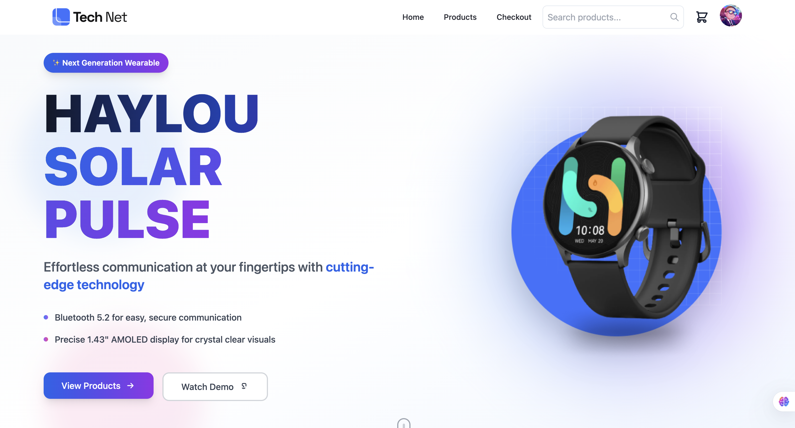

# ⌚ Tech Net - Haylou Smartwatch E-commerce Platform



Welcome to **Tech Net**, your premier destination for cutting-edge Haylou smartwatch technology! This modern e-commerce platform is built with React, Redux Toolkit, and TypeScript on the frontend, powered by Express.js and MongoDB on the backend.

---

## 🌟 Live Demo

**🔗 [Visit Tech Net Store](https://awesometechnet.netlify.app) | [Backend Repo](https://github.com/aihridoy/technet-server)**

Experience the future of wearable technology with our complete Haylou smartwatch collection!

---

## ✨ Key Features

### 🛒 E-commerce Functionality

- Complete product catalog with detailed specifications
- Advanced filtering system (price range, availability)
- Shopping cart with Redux state management
- Secure checkout process with Firebase Authentication
- Order tracking and history management
- User account dashboard with purchase history

### 📱 Product Showcase

- **Haylou Solar Pulse Series** - Flagship collection with AMOLED displays
- **Haylou RS Series** - Performance-focused smartwatches ($63.07)
- **Haylou RT Series** - Everyday wellness companions ($38.99)
- **Haylou GS Series** - Classic design meets modern technology ($32.38)
- **Haylou GST Series** - Premium features at affordable prices ($31.99)

### 🔐 User Experience

- Firebase Authentication integration
- Personalized user accounts and profiles
- Order history tracking with detailed breakdowns
- Secure payment processing
- Real-time state management with Redux
- Responsive design with Tailwind CSS

---

## 🛠️ Tech Stack

### Frontend

- **Framework**: [React 18](https://reactjs.org/) with TypeScript
- **State Management**: [Redux Toolkit](https://redux-toolkit.js.org/) + React Redux
- **Build Tool**: [Vite](https://vitejs.dev/) for fast development and building
- **Styling**: [Tailwind CSS](https://tailwindcss.com/) with custom animations
- **UI Components**: [Radix UI](https://www.radix-ui.com/) primitives
- **Routing**: React Router DOM v6
- **Icons**: Lucide React + React Icons
- **Animations**: Framer Motion
- **Forms**: React Hook Form
- **Authentication**: Firebase Auth

### Backend

- **Runtime**: [Node.js](https://nodejs.org/)
- **Framework**: [Express.js](https://expressjs.com/)
- **Database**: [MongoDB](https://www.mongodb.com/) with native driver
- **Environment**: dotenv for configuration
- **CORS**: Enabled for cross-origin requests

### Development Tools

- **TypeScript**: Full type safety
- **ESLint**: Code linting and formatting
- **Prettier**: Code formatting
- **Nodemon**: Backend development server

---

## 🚀 Featured Products

### 🏆 Haylou Solar Pulse RT3

- **Price**: $48.79
- **Features**: Bluetooth 5.2, secure communication, 1.47" AMOLED display
- **Rating**: ⭐⭐⭐⭐⭐ (5/5)
- **Status**: In Stock

### ⚡ Haylou RS3

- **Price**: $63.07
- **Features**: Advanced fitness tracking, multiple sport modes
- **Rating**: ⭐⭐⭐⭐⭐ (5/5)
- **Status**: In Stock

### 🎯 Additional Models

- **Haylou GST**: $31.99 (Rating: 4/5)
- **Haylou GS**: $32.38 (Rating: 3/5)
- **Haylou RT2**: $38.99 (Rating: 2/5)
- **Haylou RS4 Plus**: $54.84 (Rating: 4/5)

---

## 🚀 Getting Started

### Prerequisites

Before you begin, ensure you have the following installed:

- **Node.js** (>= 18.x) - [Download here](https://nodejs.org/)
- **MongoDB** (local instance or [MongoDB Atlas](https://www.mongodb.com/atlas))
- **Git** - [Download here](https://git-scm.com/)
- **npm** or **yarn** package manager

### Installation Steps

1. **Clone the Repository**

   ```bash
   git clone https://github.com/yourusername/technet-react-redux.git
   cd technet-react-redux
   ```

2. **Backend Setup**

   ```bash
   # Navigate to backend directory (if separate)
   cd backend

   # Install backend dependencies
   npm install

   # Create .env file
   touch .env
   ```

3. **Backend Environment Configuration**

   Create a `.env` file in the backend directory:

   ```env
   # MongoDB Configuration
   DB_USER=your_db_username
   DB_PASS=your_db_user_password
   ```

4. **Frontend Setup**

   ```bash
   # Navigate to frontend directory (or root if monorepo)
   cd ..  # if you were in backend directory

   # Install frontend dependencies
   npm install
   ```

5. **Frontend Environment Configuration**

   Create a `.env.local` file in the frontend root:

   ```env
   # API Configuration
   VITE_API_BASE_URL=http://localhost:8000

   # Firebase Configuration
   VITE_FIREBASE_API_KEY=your_firebase_api_key
   VITE_FIREBASE_AUTH_DOMAIN=your_project.firebaseapp.com
   VITE_FIREBASE_PROJECT_ID=your_project_id
   VITE_FIREBASE_STORAGE_BUCKET=your_project.firebasestorage.app
   VITE_FIREBASE_MESSAGING_SENDER_ID=your_sender_id
   VITE_FIREBASE_APP_ID=your_app_id
   ```

6. **Start Development Servers**

   **Backend** (in backend directory or separate terminal):

   ```bash
   npm run dev  # Uses nodemon for auto-restart
   # Backend runs on http://localhost:8000
   ```

   **Frontend** (in frontend directory or main terminal):

   ```bash
   npm run dev  # Uses Vite dev server
   # Frontend runs on http://localhost:3000
   ```

7. **Access the Application**

   Open [http://localhost:3000](http://localhost:5173) in your browser to start shopping!

### Production Build

**Frontend Build:**

```bash
npm run build      # TypeScript compilation + Vite build
npm run preview    # Preview production build locally
```

**Backend Production:**

```bash
npm start          # Run production server
```

---

## 📁 Project Structure

```
technet-react-redux/
├── src/                           # Frontend source code
│   ├── assets/                    # Static assets (images, icons)
│   ├── components/                # Reusable React components
│   │   ├── ui/                    # Radix UI styled components
│   │   ├── ProductCard/           # Product display components
│   │   ├── Cart/                  # Shopping cart components
│   │   └── Layout/                # Page layout components
│   ├── layouts/                   # Page layout wrappers
│   ├── lib/                       # Utility functions and configurations
│   ├── pages/                     # Main page components
│   │   ├── Home/                  # Homepage
│   │   ├── Products/              # Product listing and details
│   │   ├── Checkout/              # Checkout process
│   │   └── Account/               # User account pages
│   ├── redux/                     # Redux store configuration
│   │   ├── store.ts               # Store setup
│   │   ├── slices/                # Redux slices
│   │   └── api/                   # API slice configurations
│   ├── routes/                    # React Router configuration
│   ├── types/                     # TypeScript type definitions
│   ├── App.tsx                    # Main App component
│   ├── main.tsx                   # Application entry point
│   └── index.css                  # Global styles (Tailwind imports)
├── backend/                       # Backend server code
│   ├── routes/                    # Express routes
│   ├── models/                    # MongoDB models
│   ├── middleware/                # Express middleware
│   ├── controllers/               # Route controllers
│   └── index.js                   # Server entry point
├── public/                        # Static public assets
├── dist/                          # Built frontend files
├── target/                        # Build artifacts
├── .env.local                     # Frontend environment variables
├── .eslintrc.cjs                  # ESLint configuration
├── .gitignore                     # Git ignore rules
├── .prettierrc.json               # Prettier configuration
├── index.html                     # HTML template
├── package-lock.json              # Frontend dependencies lock
├── package.json                   # Frontend dependencies
├── postcss.config.js              # PostCSS configuration
├── tailwind.config.js             # Tailwind CSS configuration
├── tsconfig.json                  # TypeScript configuration
├── tsconfig.node.json             # TypeScript Node configuration
├── vite.config.ts                 # Vite configuration
└── README.md                      # Project documentation
```

---

## 🔧 Key Technologies Deep Dive

### 🎯 Frontend Architecture

**React 18 with TypeScript:**

- Modern React with Hooks and functional components
- Full TypeScript integration for type safety
- Vite for lightning-fast development experience

**Redux Toolkit State Management:**

```typescript
// Example store slice
import { createSlice } from '@reduxjs/toolkit';

const cartSlice = createSlice({
  name: 'cart',
  initialState: { items: [], total: 0 },
  reducers: {
    addItem: (state, action) => {
      // Redux Toolkit uses Immer under the hood
    },
  },
});
```

**Radix UI Components:**

- Accessible, unstyled UI primitives
- Custom styling with Tailwind CSS
- Components include: Dialog, Dropdown, Toast, etc.

### ⚡ Backend Architecture

**Express.js API:**

```javascript
// Example API endpoint
app.get('/api/products', async (req, res) => {
  try {
    const products = await db.collection('products').find().toArray();
    res.json(products);
  } catch (error) {
    res.status(500).json({ error: error.message });
  }
});
```

**MongoDB Integration:**

- Native MongoDB driver
- Document-based data storage
- Scalable NoSQL architecture

---

## 🔐 Authentication & Security

### Firebase Authentication

- Email/password authentication
- Social login options (Google, Facebook)
- Secure token-based authentication
- Protected routes and user sessions

### Security Features

- CORS configuration for secure cross-origin requests
- Environment variable protection
- Input validation and sanitization
- Secure API endpoints

---

## 📱 Responsive Design

### Tailwind CSS Implementation

- Mobile-first design approach
- Responsive breakpoints:
  - `sm`: 640px and up
  - `md`: 768px and up
  - `lg`: 1024px and up
  - `xl`: 1280px and up

### Component Responsiveness

- Adaptive layouts for all screen sizes
- Touch-friendly interface elements
- Optimized images and assets

---

## 🎨 UI/UX Features

### Modern Design System

- Consistent color palette and typography
- Smooth animations with Framer Motion
- Interactive hover states and transitions
- Accessibility-first component design

### User Experience

- Intuitive navigation and product discovery
- Fast search and filtering capabilities
- Seamless checkout process
- Real-time cart updates

---

## 🔄 Development Workflow

### Scripts Available

**Frontend:**

```bash
npm run dev      # Start Vite development server
npm run build    # TypeScript compilation + production build
npm run lint     # ESLint code analysis
npm run preview  # Preview production build
```

**Backend:**

```bash
npm start        # Start production server
npm run dev      # Start development server with nodemon
```

### Code Quality

- ESLint for code linting and consistency
- Prettier for code formatting
- TypeScript for type safety
- Husky for git hooks (if configured)

---

## 🚀 Deployment

### Frontend Deployment (Vercel/Netlify)

```bash
npm run build    # Creates optimized production build in /dist
```

### Backend Deployment (Render/Railway/Vercel)

- Express.js server ready for deployment
- Environment variables configuration
- MongoDB Atlas integration

---

## 🧪 Testing (Future Implementation)

### Recommended Testing Stack

- **Unit Testing**: Vitest + React Testing Library
- **E2E Testing**: Playwright or Cypress
- **Component Testing**: Storybook
- **API Testing**: Jest + Supertest

---

## 🔮 Future Enhancements

- 📱 **Progressive Web App (PWA)**: Offline functionality and app-like experience
- 🔍 **Advanced Search**: Elasticsearch integration for powerful search
- 💳 **Payment Integration**: Stripe/PayPal checkout implementation
- 📊 **Analytics**: Google Analytics and user behavior tracking
- 🌐 **Internationalization**: Multi-language support with React i18n
- 🤖 **AI Recommendations**: Machine learning-based product suggestions
- 📱 **React Native App**: Mobile companion application

---

## 🐛 Known Issues & Troubleshooting

### Common Issues

1. **CORS Errors**: Ensure backend CORS is configured for frontend URL
2. **Firebase Config**: Verify all Firebase environment variables are set
3. **MongoDB Connection**: Check MongoDB URI and network connectivity
4. **Port Conflicts**: Default ports are 5173 (frontend) and 8000 (backend)

### Debug Commands

```bash
# Check if ports are in use
netstat -an | grep :5173
netstat -an | grep :8000

# Clear npm cache if needed
npm cache clean --force
```

---

## 🤝 Contributing

1. Fork the repository
2. Create your feature branch (`git checkout -b feature/AmazingFeature`)
3. Commit your changes (`git commit -m 'Add some AmazingFeature'`)
4. Push to the branch (`git push origin feature/AmazingFeature`)
5. Open a Pull Request

---

## 📄 License

This project is licensed under the MIT License - see the [LICENSE](LICENSE) file for details.

---

## 👥 Team

- **Frontend Developer**: React/Redux/TypeScript specialist
- **Backend Developer**: Node.js/Express.js expert
- **UI/UX Designer**: Modern design and user experience
- **DevOps Engineer**: Deployment and infrastructure

---

## 📞 Support & Contact

### 🛟 Developer Support

- **GitHub Issues**: [Report bugs and feature requests](https://github.com/yourusername/technet-react-redux/issues)
- **Documentation**: Comprehensive README and code comments
- **Discord/Slack**: Development community chat

### 📧 Business Contact

- **Email**: contact@technet-store.com
- **Business Inquiries**: business@technet-store.com

---

## 🙏 Acknowledgments

- **React Team** for the amazing frontend framework
- **Redux Team** for excellent state management
- **Tailwind CSS** for utility-first CSS framework
- **Radix UI** for accessible component primitives
- **Firebase** for authentication and backend services
- **MongoDB** for flexible document database
- **Vite** for fast build tooling

---

**Experience the Future of Wearable Technology with Tech Net! ⌚✨**

_Leading the future of wearable technology with innovative smartwatches that combine style, functionality, and cutting-edge features. Built with modern React, Redux, and TypeScript for the best developer and user experience._
